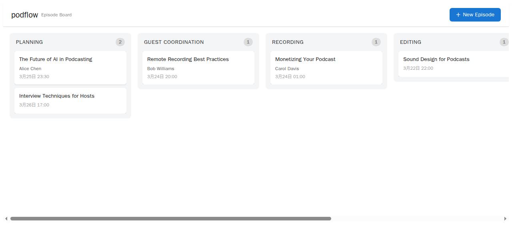
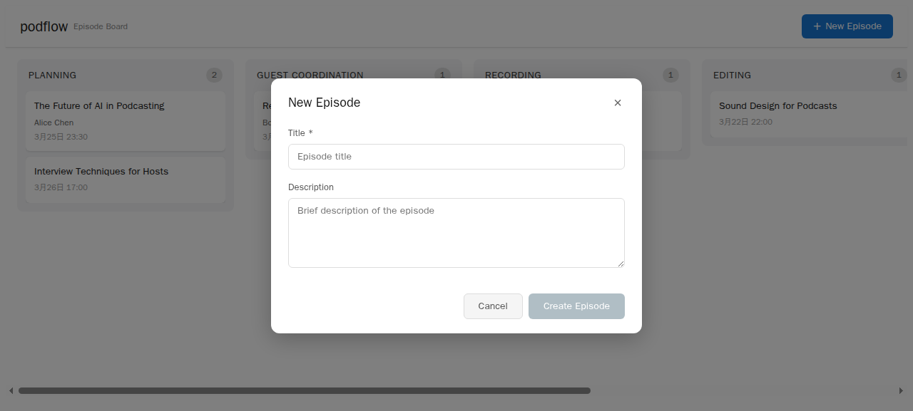
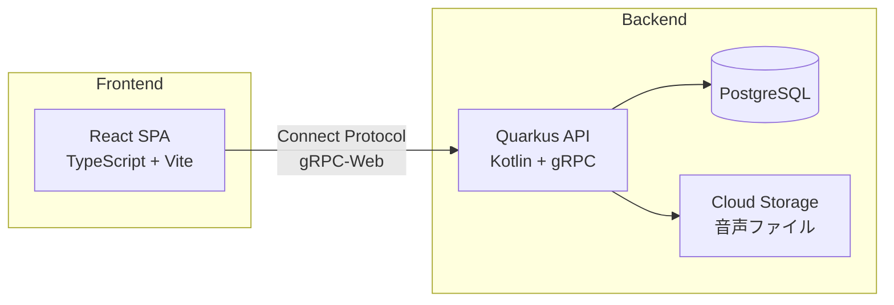
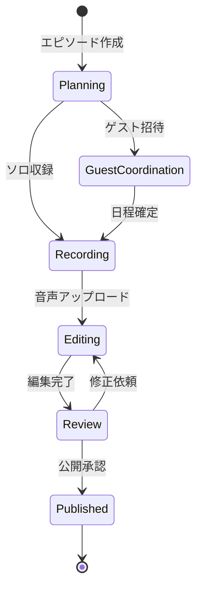

# podflow

> **Warning**: このプロジェクトはMVPです。本番環境で公開する前に、以下の対応が必須です:
> - **認証・認可**: 現在すべてのエンドポイントが認証なしでアクセス可能です（[ADR-001](docs/adr/001-auth-out-of-scope.md) で意図的にスコープ外としています）
> - **HTTPS**: 本番ではTLS終端を設定してください
> - **CORS**: `CORS_ORIGINS` 環境変数で許可オリジンを制限してください
>
> **このMVPをインターネットに公開しないでください。** ローカル/プライベート環境での使用を前提としています。

Podcast制作のワークフローを一元管理するツール。企画→収録→編集→公開の各ステージをカンバンで管理し、ゲスト調整・ショーノート生成・配信プラットフォームへの一括公開を自動化。

## Demo

### カンバンボード



6カラム（Planning → Guest Coordination → Recording → Editing → Review → Published）でエピソードの制作進捗を一覧管理。ドラッグ&ドロップでステータス変更、カードクリックで詳細編集。

### エピソード作成



タイトルと概要を入力して新規エピソードを作成。自動的に「Planning」ステータスで追加される。モバイル（768px以下）ではリストビューに自動切替。

## 何ができるか

- **カンバンボード**: 6ステージ（Planning → Guest Coordination → Recording → Editing → Review → Published）でエピソードを管理
- **ドラッグ&ドロップ**: dnd-kit によるスムーズなカード移動（有効な遷移のみ許可）
- **エピソード作成・編集・削除**: モーダル UI で CRUD 操作
- **レスポンシブ対応**: デスクトップはカンバン、モバイル（768px以下）はリストビュー
- **ショーノート編集**: Markdown でショーノートを記録

## クイックスタート

```bash
# リポジトリのクローン
git clone https://github.com/akaitigo/podflow.git
cd podflow

# フロントエンドの起動
cd frontend
pnpm install
pnpm dev
# http://localhost:5173 でカンバンボードが表示されます（モックデータで動作）
```

フロントエンドはモックAPIで完全に動作するため、バックエンドやDBのセットアップは不要です。

### バックエンド（オプション）

```bash
# JDK 21+ が必要
cd backend
./gradlew quarkusDev   # http://localhost:8080, gRPC :9000
```

### 品質チェック

```bash
# 全チェック一括実行
make check

# フロントエンドのみ
cd frontend && pnpm run check   # format + lint + typecheck + test + build

# バックエンドのみ
cd backend && ./gradlew build   # compile + test

# Proto lint
buf lint proto/
```

## アーキテクチャ



### エピソード制作フロー



## 技術スタック

| レイヤー | 技術 | 用途 |
|---------|------|------|
| フロントエンド | TypeScript / React 19 / Vite 6 | SPA、カンバンUI |
| ドラッグ&ドロップ | dnd-kit | カンバンカードの移動 |
| バックエンド | Kotlin / Quarkus | gRPC API サーバー |
| 通信 | Connect Protocol (gRPC-Web) | 型安全なAPI通信 ([ADR-003](docs/adr/003-grpc-web-strategy.md)) |
| データベース | PostgreSQL + Flyway | エピソード・ゲスト管理 ([ADR-002](docs/adr/002-data-model.md)) |
| ストレージ | GCP Cloud Storage | 音声ファイル保存 |
| インフラ | GCP Cloud Run | コンテナデプロイ |

## 構築済みの開発基盤

| カテゴリ | ツール | 説明 |
|---------|--------|------|
| Lint (Frontend) | [Biome](https://biomejs.dev/) + [oxlint](https://oxc-project.github.io/) | フォーマット + lint を統合 |
| Lint (Backend) | Kotlin Compiler + Quarkus Build | `./gradlew build` でコンパイルエラー検出 |
| Lint (Proto) | [buf](https://buf.build/) | Proto lint + format |
| テスト (Frontend) | [Vitest](https://vitest.dev/) + Testing Library | コンポーネントテスト + ユニットテスト |
| テスト (Backend) | JUnit 5 + Quarkus Test | gRPC サービステスト |
| CI | GitHub Actions | proto-lint / frontend (lint+typecheck+test+build) / backend (build+test) |
| 型安全 | TypeScript strict + Proto 定義 | フロントエンドからバックエンドまで型安全 |

### テストカバレッジ

- **フロントエンド**: Vitest で 24 テスト（コンポーネント・API・ビジネスロジック）
- **バックエンド**: JUnit で 62 テスト（gRPC サービス・モデル・マッパー・ヘルスチェック）
- **CI**: 全テストが GitHub Actions で自動実行

## ドキュメント

- [PRD（製品要求仕様書）](PRD.md)
- [ユースケース](docs/use-cases.md) — ユーザーフローと操作シナリオ
- [画面設計](docs/screens.md) — コンポーネント構成と画面遷移
- **ADR（アーキテクチャ判断記録）**:
  - [ADR-002: データモデル設計](docs/adr/002-data-model.md) — Episode + Guest エンティティ、Flyway、Panache Repository
  - [ADR-003: gRPC-Web 方式](docs/adr/003-grpc-web-strategy.md) — Connect Protocol vs Envoy の選定

## ディレクトリ構造

```
podflow/
├── frontend/              React SPA (Vite + TypeScript + dnd-kit)
│   └── src/
│       ├── components/    UI コンポーネント (KanbanBoard, Modal, Header...)
│       ├── hooks/         カスタムフック (useEpisodes, useMediaQuery)
│       ├── lib/           API クライアント + モックデータ
│       ├── types/         型定義 (Episode, EpisodeStatus)
│       └── __tests__/     Vitest テスト
├── backend/               Quarkus API (Kotlin + gRPC)
│   └── src/
│       ├── main/kotlin/   サービス・モデル・リポジトリ
│       └── test/kotlin/   JUnit テスト
├── proto/                 Protocol Buffers 定義（共有）
├── docs/                  ドキュメント
│   ├── adr/               Architecture Decision Records
│   ├── screens.md         画面設計
│   └── use-cases.md       ユースケース
└── .github/workflows/     CI/CD
```

## ライセンス

MIT
