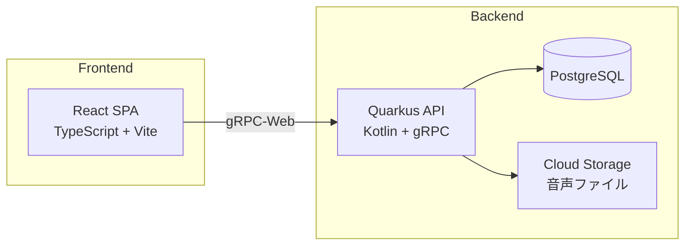
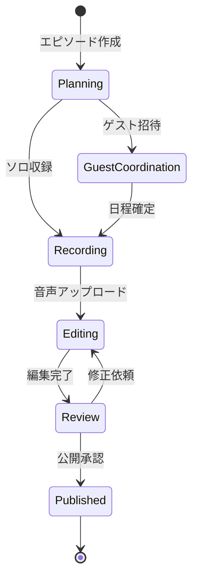

# podflow

Podcast制作のワークフローを一元管理するツール。企画→収録→編集→公開の各ステージをカンバンで管理し、ゲスト調整・ショーノート生成・配信プラットフォームへの一括公開を自動化。

## 何ができるか

```
┌──────────────────────────────────────────────────────────────────────┐
│  Planning    Guest Coord.   Recording     Editing    Review  Published│
│  ┌────────┐  ┌───────────┐  ┌──────────┐                  ┌────────┐│
│  │ #12    │  │ #10       │  │ #9       │                  │ #7     ││
│  │ AI倫理 │  │ 地方移住  │  │ 副業の   │                  │ 起業の ││
│  │        │  │ 🎤田中さん│  │ はじめ方 │                  │ 落とし穴│
│  │ 3/25   │  │ 日程調整中│  │ 3/20収録 │                  │ ✅     ││
│  └────────┘  └───────────┘  └──────────┘                  └────────┘│
│  ┌────────┐                                                ┌────────┐│
│  │ #11    │                                                │ #6     ││
│  │ 読書術 │                                                │ 時間管理│
│  └────────┘                                                └────────┘│
└──────────────────────────────────────────────────────────────────────┘
```

- **カンバンボード**: エピソードをドラッグ&ドロップでステージ間移動
- **ゲスト管理**: 出演者の連絡先・出演履歴・日程調整を一元管理
- **ショーノート自動生成**: 収録音声から文字起こし→章立て→ショーノートを自動生成
- **一括配信**: Spotify / Apple Podcasts / YouTube への同時公開

## アーキテクチャ



### エピソード制作フロー



## 技術スタック

| レイヤー | 技術 | 用途 |
|---------|------|------|
| フロントエンド | TypeScript / React / Vite | SPA、カンバンUI |
| バックエンド | Kotlin / Quarkus | gRPC API サーバー |
| 通信 | gRPC + Protocol Buffers | 型安全なAPI通信 |
| データベース | PostgreSQL | エピソード・ゲスト管理 |
| ストレージ | GCP Cloud Storage | 音声ファイル保存 |
| インフラ | GCP Cloud Run | コンテナデプロイ |

## ドキュメント

- [PRD（製品要求仕様書）](PRD.md)
- [ユースケース](docs/use-cases.md) — ユーザーフローと操作シナリオ
- [画面設計](docs/screens.md) — ワイヤーフレームと画面遷移
- [ADR](docs/adr/) — アーキテクチャ判断の記録

## セットアップ

### 前提条件

- Node.js 22+ / pnpm
- JDK 21+
- PostgreSQL 16+
- buf CLI

### フロントエンド

```bash
cd frontend
pnpm install
pnpm dev        # http://localhost:5173
```

### バックエンド

```bash
cd backend
./gradlew quarkusDev   # http://localhost:8080, gRPC :9000
```

### Proto

```bash
buf lint proto/
buf generate proto/
```

## ライセンス

MIT
