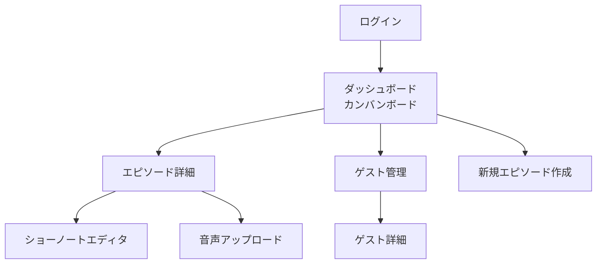
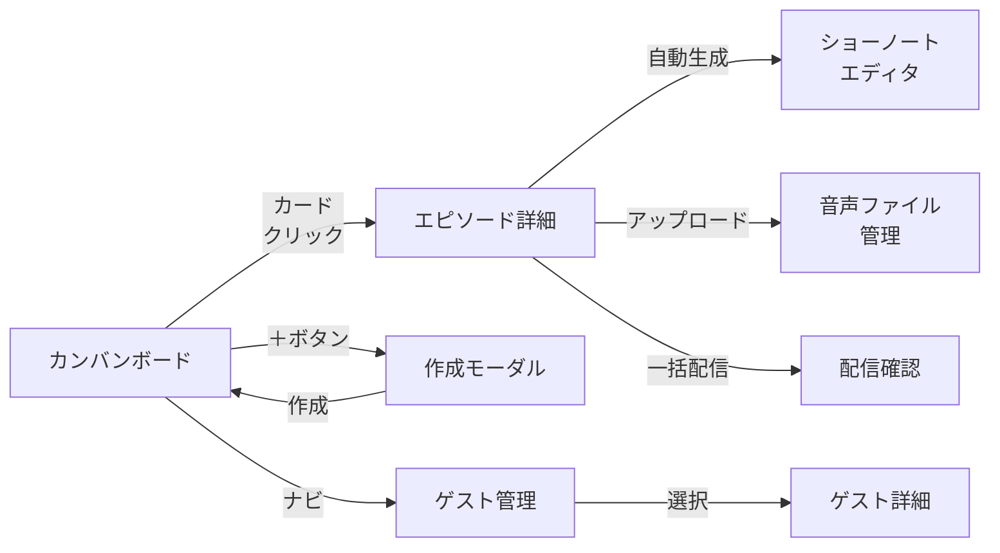

# 画面設計

## 画面一覧



---

## S-1: カンバンボード（メイン画面）

全エピソードの制作ステータスを一覧表示する。Trello/GitHub Projects ライクなカラム型レイアウト。

```
┌─────────────────────────────────────────────────────────────────────────────┐
│  podflow                                            [+ 新規エピソード]  👤  │
├─────────────────────────────────────────────────────────────────────────────┤
│                                                                             │
│  Planning    Guest Coord.   Recording     Editing     Review    Published   │
│  ─────────   ────────────   ──────────   ─────────   ────────   ──────────  │
│  ┌────────┐  ┌────────────┐ ┌──────────┐                       ┌─────────┐ │
│  │ #12    │  │ #10        │ │ #9       │                       │ #7      │ │
│  │ AI倫理 │  │ 地方移住の │ │ 副業の   │                       │ 起業の  │ │
│  │ を考え │  │ リアル     │ │ はじめ方 │                       │ 落とし穴│ │
│  │ る回   │  │            │ │          │                       │         │ │
│  │        │  │ 🎤 田中さん│ │ 🎤 佐藤 │                       │ 2/15公開│ │
│  │ 3/25   │  │ 日程調整中 │ │ 3/20収録 │                       │ ✅      │ │
│  └────────┘  └────────────┘ └──────────┘                       └─────────┘ │
│  ┌────────┐                                                     ┌─────────┐ │
│  │ #11    │                                                     │ #6      │ │
│  │ 読書術 │                                                     │ 時間管理│ │
│  │ 特集   │                                                     │ 術      │ │
│  │        │                                                     │ 2/1公開 │ │
│  │ 3/28   │                                                     │ ✅      │ │
│  └────────┘                                                     └─────────┘ │
│                                                                             │
└─────────────────────────────────────────────────────────────────────────────┘
```

**操作:**
- カードをドラッグ&ドロップで別カラムに移動 → ステータス更新
- カードクリック → エピソード詳細画面に遷移
- 「+ 新規エピソード」 → 作成モーダル表示

---

## S-2: エピソード作成モーダル

```
┌──────────────────────────────────┐
│  新規エピソード作成          [×] │
├──────────────────────────────────┤
│                                  │
│  タイトル *                      │
│  ┌──────────────────────────┐    │
│  │ AI倫理を考える回         │    │
│  └──────────────────────────┘    │
│                                  │
│  概要                            │
│  ┌──────────────────────────┐    │
│  │ ChatGPTの普及で変わる    │    │
│  │ 働き方と倫理観について  │    │
│  │ ゲストと議論する。       │    │
│  └──────────────────────────┘    │
│                                  │
│  ゲスト（任意）                  │
│  ┌──────────────────────────┐    │
│  │ 🔍 田中太郎             │    │
│  └──────────────────────────┘    │
│                                  │
│  収録予定日                      │
│  ┌──────────────────────────┐    │
│  │ 2026-04-05              │    │
│  └──────────────────────────┘    │
│                                  │
│         [キャンセル]  [作成]     │
└──────────────────────────────────┘
```

---

## S-3: エピソード詳細画面

```
┌─────────────────────────────────────────────────────────────────┐
│  ← カンバンに戻る                                               │
├─────────────────────────────────────────────────────────────────┤
│                                                                 │
│  #10 地方移住のリアル                                           │
│  ステータス: [Guest Coordination ▼]                             │
│                                                                 │
│  ┌─────────────────────────┐  ┌──────────────────────────────┐  │
│  │ 📋 基本情報             │  │ 🎤 ゲスト                    │  │
│  │                         │  │                              │  │
│  │ 概要:                   │  │ 田中太郎                     │  │
│  │ 東京から長野に移住した  │  │ 📧 tanaka@example.com       │  │
│  │ ゲストに、移住の決め手  │  │ フリーランスエンジニア       │  │
│  │ や生活の変化を聞く。    │  │                              │  │
│  │                         │  │ 収録候補日:                  │  │
│  │ 作成日: 2026-03-20      │  │  ☐ 4/1 (火) 19:00          │  │
│  │ 更新日: 2026-03-25      │  │  ☑ 4/3 (木) 20:00          │  │
│  │                         │  │  ☐ 4/5 (土) 14:00          │  │
│  └─────────────────────────┘  └──────────────────────────────┘  │
│                                                                 │
│  ┌──────────────────────────────────────────────────────────┐   │
│  │ 🎵 音声ファイル                                         │   │
│  │                                                          │   │
│  │  まだアップロードされていません                          │   │
│  │  [音声ファイルをアップロード]                            │   │
│  └──────────────────────────────────────────────────────────┘   │
│                                                                 │
│  ┌──────────────────────────────────────────────────────────┐   │
│  │ 📝 ショーノート                                         │   │
│  │                                                          │   │
│  │  ## 概要                                                 │   │
│  │  東京から長野に移住した田中さんに聞く、移住のリアル。   │   │
│  │                                                          │   │
│  │  ## チャプター                                           │   │
│  │  00:00 オープニング                                      │   │
│  │  03:20 移住の決め手                                      │   │
│  │  12:45 生活コストの変化                                  │   │
│  │  25:10 リモートワークの実際                              │   │
│  │  38:00 エンディング                                      │   │
│  │                                                          │   │
│  │  [✨ ショーノートを自動生成]  [編集]                     │   │
│  └──────────────────────────────────────────────────────────┘   │
│                                                                 │
│  ┌──────────────────────────────────────────────────────────┐   │
│  │ 📡 配信                                                  │   │
│  │                                                          │   │
│  │  ☑ Spotify     ☑ Apple Podcasts    ☑ YouTube            │   │
│  │                                                          │   │
│  │  公開予定日: [2026-04-10]                                │   │
│  │                                                          │   │
│  │  [一括配信]                                              │   │
│  └──────────────────────────────────────────────────────────┘   │
│                                                                 │
└─────────────────────────────────────────────────────────────────┘
```

---

## S-4: ゲスト管理画面

```
┌─────────────────────────────────────────────────────────────────┐
│  podflow > ゲスト管理                        [+ ゲスト追加]     │
├─────────────────────────────────────────────────────────────────┤
│                                                                 │
│  🔍 ゲストを検索...                                            │
│                                                                 │
│  ┌───────────────────────────────────────────────────────────┐  │
│  │ 名前           │ メール              │ 出演回数 │ 最終出演│  │
│  ├───────────────────────────────────────────────────────────┤  │
│  │ 田中太郎       │ tanaka@example.com  │    3回   │ 2026/03 │  │
│  │ 佐藤花子       │ sato@example.com    │    2回   │ 2026/03 │  │
│  │ 山田一郎       │ yamada@example.com  │    1回   │ 2026/02 │  │
│  │ 鈴木美咲       │ suzuki@example.com  │    1回   │ 2026/01 │  │
│  └───────────────────────────────────────────────────────────┘  │
│                                                                 │
└─────────────────────────────────────────────────────────────────┘
```

---

## 画面遷移まとめ


