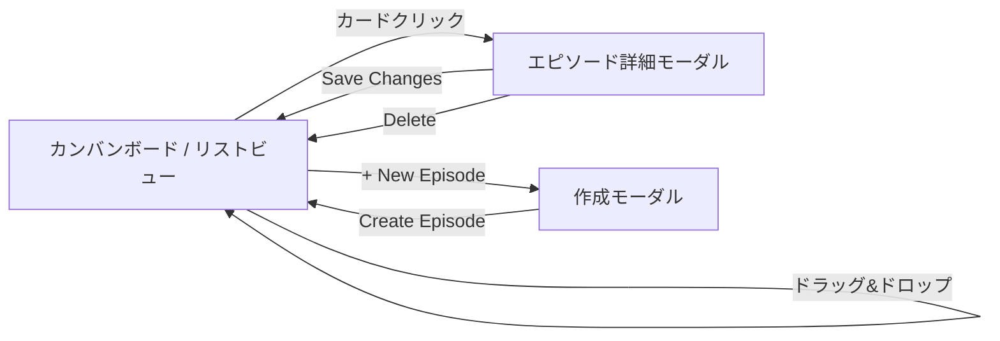

# 画面設計

## 実装済みコンポーネント構成

```
App
├── Header                    ← ロゴ + 「+ New Episode」ボタン
├── ErrorBanner               ← API エラー表示（dismissable）
├── KanbanBoard (desktop)     ← 6 カラムのカンバンボード
│   └── KanbanColumn x 6     ← Planning / Guest Coord. / Recording / Editing / Review / Published
│       └── EpisodeCard       ← ドラッグ可能なエピソードカード
├── EpisodeListView (mobile)  ← 768px 以下で表示される折りたたみリスト
├── CreateEpisodeModal        ← 新規エピソード作成フォーム
└── EpisodeDetailModal        ← エピソード詳細・編集・削除
```

### ルーティング

現在は SPA 単一ページ構成（React Router 未使用）。全画面をモーダルで表現。

| 操作 | 表示 |
|------|------|
| 初期表示 | カンバンボード（デスクトップ） or リストビュー（モバイル） |
| 「+ New Episode」クリック | CreateEpisodeModal |
| カードクリック | EpisodeDetailModal |
| カードをドラッグ&ドロップ | ステータス変更（canTransition ルールに従う） |

### レスポンシブ対応

- `useIsMobile()` フック（`max-width: 768px`）で切り替え
- デスクトップ: `KanbanBoard`（横スクロール 6 カラム、dnd-kit によるドラッグ&ドロップ）
- モバイル: `EpisodeListView`（ステータスごとの折りたたみセクション、セレクトボックスによるステータス変更）

---

## S-1: カンバンボード（メイン画面）

全エピソードの制作ステータスを一覧表示する。6 カラムのカンバンレイアウト。

**実装**: `KanbanBoard.tsx` + `KanbanColumn.tsx` + `EpisodeCard.tsx`

```
┌─────────────────────────────────────────────────────────────────────────────┐
│  podflow   Episode Board                              [+ New Episode]      │
├─────────────────────────────────────────────────────────────────────────────┤
│                                                                             │
│  PLANNING (2)  GUEST COORD. (1)  RECORDING (1)  EDITING (1)  REVIEW (1)  PUBLISHED (1) │
│  ─────────────  ────────────────  ─────────────  ──────────  ──────────  ──────────── │
│  ┌───────────┐  ┌──────────────┐  ┌───────────┐  ┌────────┐  ┌────────┐  ┌──────────┐ │
│  │ The Future│  │ Remote       │  │ Monetizing│  │ Sound  │  │ Building│  │ Podcast  │ │
│  │ of AI in  │  │ Recording    │  │ Your      │  │ Design │  │ a Pod-  │  │ SEO and  │ │
│  │ Podcasting│  │ Best         │  │ Podcast   │  │ for    │  │ cast    │  │ Discover-│ │
│  │           │  │ Practices    │  │           │  │ Pods   │  │ Commu-  │  │ ability  │ │
│  │ Alice Chen│  │ Bob Williams │  │ Carol     │  │        │  │ nity    │  │          │ │
│  │ 3/25      │  │ 3/24         │  │ Davis     │  │ 3/22   │  │ Eve     │  │ 3/20     │ │
│  └───────────┘  └──────────────┘  │ 3/23      │  └────────┘  │ Johnson │  └──────────┘ │
│  ┌───────────┐                    └───────────┘              │ 3/21    │              │
│  │ Interview │                                               └────────┘              │
│  │ Techniques│                                                                       │
│  │ for Hosts │                                                                       │
│  │ 3/26      │                                                                       │
│  └───────────┘                                                                       │
│                                                                                       │
└───────────────────────────────────────────────────────────────────────────────────────┘
```

**操作:**
- カードをドラッグ&ドロップで別カラムに移動 → ステータス更新（許可された遷移のみ）
- カードクリック → エピソード詳細モーダルを表示
- 「+ New Episode」 → 作成モーダル表示

---

## S-2: エピソード作成モーダル

**実装**: `CreateEpisodeModal.tsx`

```
┌──────────────────────────────────┐
│  New Episode                 [x] │
├──────────────────────────────────┤
│                                  │
│  Title *                         │
│  ┌──────────────────────────┐    │
│  │                          │    │
│  └──────────────────────────┘    │
│                                  │
│  Description                     │
│  ┌──────────────────────────┐    │
│  │                          │    │
│  │                          │    │
│  └──────────────────────────┘    │
│                                  │
│         [Cancel]  [Create Episode] │
└──────────────────────────────────┘
```

**フィールド:**
- Title（必須）: テキスト入力
- Description（任意）: テキストエリア
- ステータスは自動的に `PLANNING` に設定

---

## S-3: エピソード詳細モーダル

**実装**: `EpisodeDetailModal.tsx`

```
┌──────────────────────────────────┐
│  Episode Details             [x] │
├──────────────────────────────────┤
│                                  │
│  [PLANNING]                      │
│                                  │
│  Title                           │
│  ┌──────────────────────────┐    │
│  │ The Future of AI in...   │    │
│  └──────────────────────────┘    │
│                                  │
│  Description                     │
│  ┌──────────────────────────┐    │
│  │ Exploring how AI tools   │    │
│  │ are transforming...      │    │
│  └──────────────────────────┘    │
│                                  │
│  Status                          │
│  ┌──────────────────────────┐    │
│  │ Planning              ▼  │    │
│  └──────────────────────────┘    │
│                                  │
│  Show Notes (Markdown)           │
│  ┌──────────────────────────┐    │
│  │                          │    │
│  └──────────────────────────┘    │
│                                  │
│  Guest: Alice Chen               │
│                                  │
│  [Delete]      [Cancel] [Save]   │
└──────────────────────────────────┘
```

**機能:**
- ステータスバッジ（色分け表示）
- Title / Description / Show Notes の編集
- ステータス変更（許可された遷移のみセレクトボックスに表示）
- エピソード削除（確認ダイアログ付き）
- 変更がない場合は Save ボタン無効

---

## S-4: モバイルリストビュー

**実装**: `EpisodeListView.tsx`（768px 以下で自動切替）

```
┌──────────────────────────────────┐
│  podflow   Episode Board  [+]   │
├──────────────────────────────────┤
│                                  │
│  Planning (2)                    │
│  ├ The Future of AI in Pod...    │
│  │ Alice Chen · 3/25             │
│  │ [Planning ▼]                  │
│  ├ Interview Techniques for...   │
│  │ 3/26                          │
│  │ [Planning ▼]                  │
│                                  │
│  Guest Coordination (1)          │
│  ├ Remote Recording Best...      │
│  │ Bob Williams · 3/24           │
│  │ [Guest Coordination ▼]        │
│                                  │
│  ...                             │
└──────────────────────────────────┘
```

---

## 画面遷移まとめ



## 未実装画面（Phase 1 以降）

- ゲスト管理画面（S-4 旧設計）
- ショーノートエディタ
- 音声アップロード
- 配信設定画面
