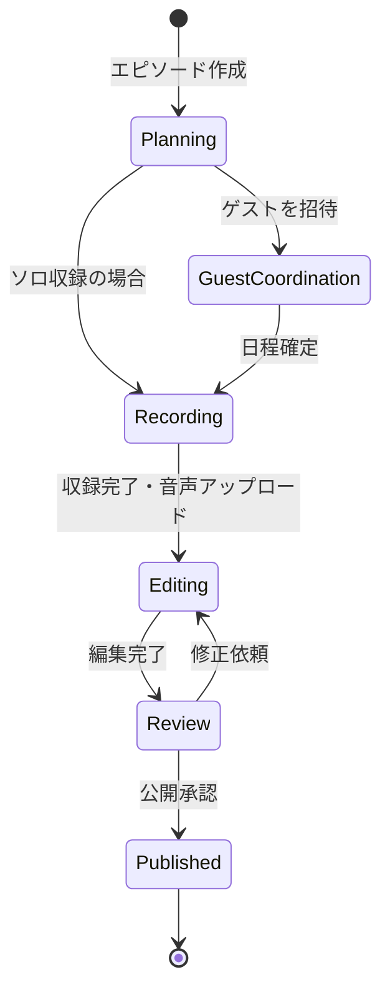
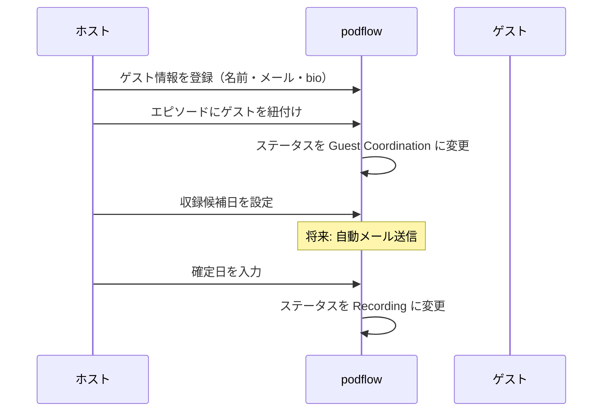
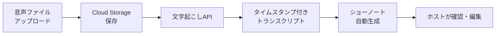
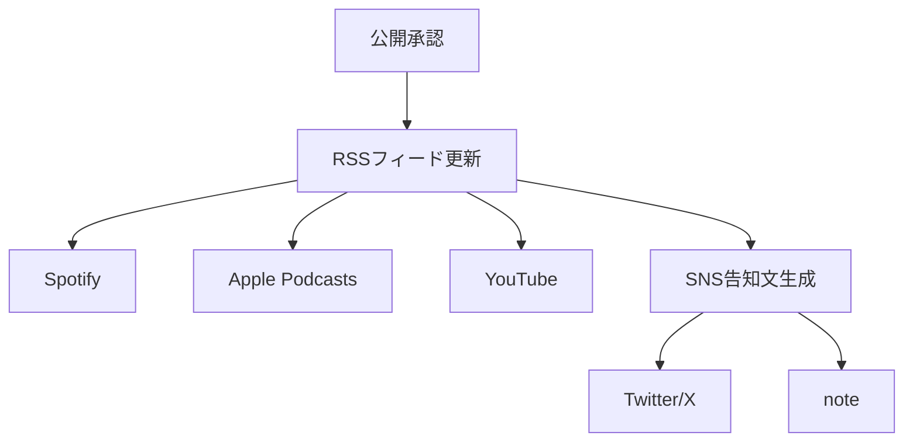

# ユースケース

## UC-1: エピソード制作をカンバンで管理する

**アクター**: Podcastホスト
**前提条件**: ログイン済み

### フロー

### シナリオ

1. ホストが「新規エピソード」ボタンを押す
2. タイトル・概要・ゲスト（任意）を入力して作成
3. カンバンボードの「Planning」カラムにカードが表示される
4. カードをドラッグして次のステージに移動する
5. 各ステージで必要な情報（収録日、音声ファイル等）を入力する
6. 「Published」に到達したらRSSフィードに反映される

---

## UC-2: ゲストの出演調整をする

**アクター**: Podcastホスト
**前提条件**: エピソードが「Planning」ステータス

### フロー

### シナリオ

1. ホストがゲスト管理画面で新規ゲストを登録する
2. エピソード詳細画面でゲストを選択・紐付けする
3. ステータスが自動的に「Guest Coordination」に遷移する
4. 収録日が確定したらステータスを「Recording」に進める

---

## UC-3: 収録音声からショーノートを生成する（Phase 1）

**アクター**: Podcastホスト
**前提条件**: エピソードが「Recording」ステータス、音声ファイルあり

### フロー

### シナリオ

1. ホストがエピソード詳細画面で音声ファイルをアップロードする
2. Cloud Storage に保存後、文字起こしAPIが起動する
3. トランスクリプトからショーノート（章立て + 要約）が自動生成される
4. ホストが生成結果を確認・編集する
5. ステータスを「Editing」に進める

---

## UC-4: 複数プラットフォームに一括配信する（Phase 2）

**アクター**: Podcastホスト
**前提条件**: エピソードが「Review」ステータス、ショーノート確定済み

### フロー

