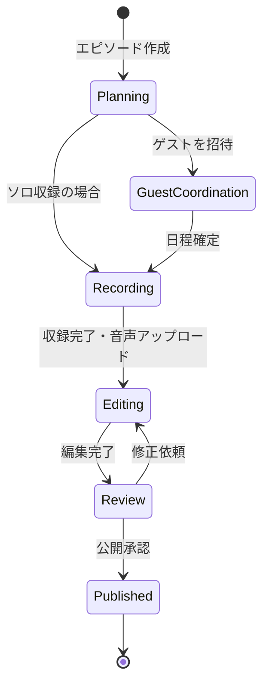
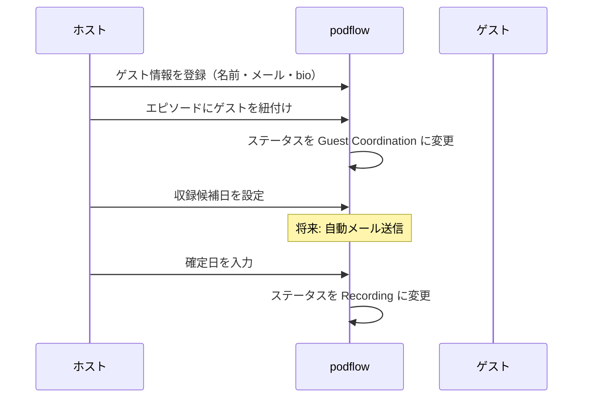
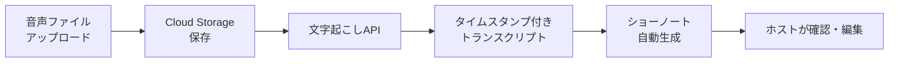
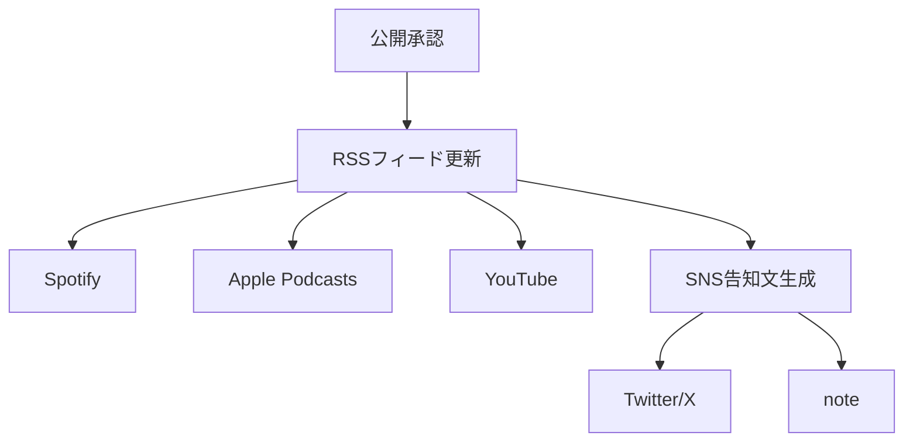

# ユースケース

## UC-1: エピソード制作をカンバンで管理する (実装済み)

**アクター**: Podcastホスト
**ステータス**: MVP 実装完了

### フロー

### 実装済みシナリオ

1. ホストが「+ New Episode」ボタンをクリック → `CreateEpisodeModal` が表示される
2. タイトル（必須）・概要（任意）を入力して「Create Episode」をクリック
3. カンバンボードの「Planning」カラムに新しいカードが表示される
4. カードをドラッグ&ドロップで次のステージに移動する（`canTransition` ルールに基づく許可された遷移のみ）
5. カードをクリックすると `EpisodeDetailModal` が表示され、詳細の編集・ステータス変更・削除が可能
6. モバイル（768px 以下）ではリストビューに自動切替、セレクトボックスでステータス変更

### 状態遷移ルール

| 現在のステータス | 遷移可能先 |
|----------------|-----------|
| Planning | Guest Coordination, Recording |
| Guest Coordination | Recording |
| Recording | Editing |
| Editing | Review |
| Review | Editing (差し戻し), Published |
| Published | (遷移不可) |

---

## UC-2: ゲストの出演調整をする (一部実装)

**アクター**: Podcastホスト
**ステータス**: データモデル定義済み、UI は Phase 1

### フロー

### MVP での実装状況

- エピソードにゲスト名が表示される（`guestName` フィールド）
- エピソード詳細モーダルでゲスト名を確認可能
- ゲスト管理画面（CRUD）は Phase 1 で実装予定

---

## UC-3: 収録音声からショーノートを生成する (Phase 1)

**アクター**: Podcastホスト
**ステータス**: 未実装（Phase 1）

### フロー

### MVP での実装状況

- ショーノートの手動入力・編集は `EpisodeDetailModal` で実装済み（Markdown テキストエリア）
- 音声アップロード・自動生成は Phase 1 で実装予定

---

## UC-4: 複数プラットフォームに一括配信する (Phase 2)

**アクター**: Podcastホスト
**ステータス**: 未実装（Phase 2）

### フロー

